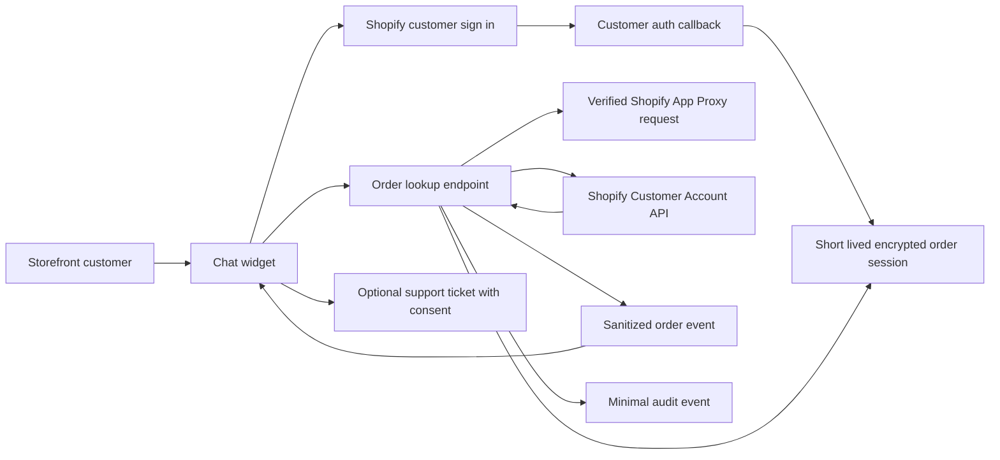

# 0002. Secure customer order lookup in chat

**Date**: 2026-10-07
**Status**: Approved

## Summary

Let a shopper securely view recent Shopify orders, order details, fulfillment status, and tracking from the storefront chat. Shopify customer accounts authenticate the buyer with Shopify's existing passwordless email code. The application reads orders through the buyer scoped Customer Account API and never gives the language model or browser a store wide Shopify credential.

The first release is read only. Requests to cancel, return, refund, or change an order continue through the existing human support ticket flow.

## Requirements

### User stories

1. As a shopper, I want to ask about my order in chat and sign in securely so that I can see current information without contacting support.
2. As a shopper, I want to choose from my recent orders and see a concise status card so that I can understand what is happening quickly.
3. As a shopper, I want a clear support path when tracking is missing, Shopify is unavailable, or I need an order changed.
4. As the merchant, I want order access limited to the authenticated buyer and excluded from conversation history so that private order data is not unnecessarily retained.

### Acceptance criteria

1. **AC-1**: An order related customer message or the existing order quick action enters the order lookup flow instead of searching the knowledge base or immediately creating a support ticket.
2. **AC-2**: An unauthenticated customer sees a clear `Sign in to view orders` action. Shopify performs passwordless email verification, and the customer returns to the same chat and conversation after authentication.
3. **AC-3**: After authentication, the widget displays no more than five recent orders that belong to the authenticated Shopify customer. It never displays another customer's order, including when a different order identifier is submitted manually.
4. **AC-4**: The recent order list displays only enough information to distinguish orders. Selecting an order displays order number, order date, item names and quantities, total, payment status, fulfillment status, carrier, tracking number, and tracking link when Shopify provides each value.
5. **AC-5**: The application does not request or display shipping addresses, billing addresses, payment instruments, customer notes, fraud data, or internal Shopify fields.
6. **AC-6**: Order cards and Customer Account API responses are ephemeral. They are not written to conversation messages, summaries, model prompts, model tool results, analytics payloads, or order snapshots in DynamoDB.
7. **AC-7**: A minimal audit event records lookup time, result, latency, customer reference, and failure category without order identifiers, line items, totals, tracking data, addresses, or message content.
8. **AC-8**: A Shopify timeout, rate limit, or transient server error receives one quiet retry. If the retry fails, the widget presents deterministic unavailable copy with `Try again` and `Contact support` actions. The model never guesses an order state.
9. **AC-9**: An order without tracking is presented as not yet having tracking information. The application does not invent a carrier, tracking number, delivery date, or shipment state.
10. **AC-10**: Cancellation, return, refund, address change, and other order mutation requests remain read only and offer the existing support ticket flow.
11. **AC-11**: Order context is attached to a support ticket only after the shopper explicitly agrees. The attached context contains only the selected order fields defined in **AC-4**.
12. **AC-12**: Expired, revoked, mismatched, malformed, replayed, or missing authentication state cannot retrieve order data and produces a safe reauthentication path.
13. **AC-13**: Order lookup is usable with keyboard and screen reader navigation, has visible focus, announces loading and failure states, and remains usable at the widget's supported mobile widths.
14. **AC-14**: Automated tests prove routing, customer isolation, field minimization, non-persistence, retry behavior, session expiry, missing orders, missing tracking, support consent, and accessible interaction states.

## Decision

Use Shopify's Customer Account API with OAuth 2.0, OpenID Connect discovery, Proof Key for Code Exchange, state, and nonce validation. The buyer grants access to their own account data. Request only the protected customer data access and Shopify customer scopes required to read orders, expected to include `customer_read_orders`.

Do not add GraphQL Admin API order access for this feature. The Admin API authenticates the application and would give the backend a credential capable of reading orders across the store. The Customer Account API authenticates the buyer and constrains the available data to that buyer.

## Scope

### Included

1. Detect order status and order detail requests.
2. Shopify customer account sign in and callback handling.
3. A short lived, server side customer order session.
4. A recent order selector containing up to five orders.
5. A compact order detail card using the existing widget visual system.
6. Live order detail and tracking retrieval.
7. Deterministic missing, unavailable, and expired states.
8. An optional handoff to the existing ticket flow with explicit context consent.
9. Security, privacy, accessibility, observability, and automated verification.

### Non-goals

1. Canceling, editing, returning, exchanging, or refunding an order through chat.
2. Editing shipping or billing addresses.
3. Displaying payment instrument information.
4. Persisting order history or using order contents for model training.
5. Merchant order management inside the support dashboard.
6. Looking up an order from an order number and email address without Shopify authentication.

## Architecture

The language model participates only in deciding that a customer wants order help. Private order data bypasses the model. Order endpoints emit typed application events that the widget renders directly.

### Routing

1. Extend the current quick action and deterministic order intent handling to route read requests into an `order_lookup` application flow.
2. Preserve human handoff routing for cancellations, refunds, returns, complaints, damaged deliveries, address changes, payment disputes, and requests for a person.
3. When intent is ambiguous, ask a narrow clarification before authenticating.
4. Do not call the vector database for a request that requires live order state.
5. General policy questions about shipping, returns, or order care continue through the knowledge pipeline unless the customer asks about their specific order.

### Customer authentication flow

1. The widget requests an authorization start URL through the verified Shopify App Proxy boundary.
2. The backend creates a cryptographically random state value, nonce, and PKCE verifier. It stores their hashes with the chat session, shop, return location, and a short expiry.
3. The backend discovers Shopify's current authorization, token, and Customer Account API endpoints from the store's official discovery documents. Discovered hosts must match the configured Shopify store or Shopify controlled account host before use.
4. The shopper follows Shopify's existing passwordless account sign in and enters the email code supplied by Shopify.
5. The callback validates state, issuer, audience, nonce, timestamps, and PKCE before exchanging the authorization code.
6. The backend derives the authenticated customer identifier from the validated identity token and stores the Customer Account API access token encrypted under a dedicated KMS key. Store only the encrypted token, shop, customer identifier, chat session binding, issue time, and expiry.
7. The order session expires after the shorter of the provider token expiry or 15 minutes. It has a DynamoDB TTL and cannot be refreshed silently. An expired session starts Shopify authentication again.
8. The callback returns the shopper to the original storefront page. The widget restores the existing conversation from its current tab scoped persistence.
9. Every order request verifies the Shopify App Proxy signature, expected shop, chat session binding, token expiry, and authenticated customer match before reading orders.

The order session is authentication material, not an order snapshot. It is deleted by TTL and by the existing customer deletion path.

### Application boundaries

Add an order access port to `packages/core` and a Shopify Customer Account adapter to `packages/adapters`. The core port deals only in minimized application types and does not expose raw GraphQL responses.

Suggested operations:

1. `beginCustomerOrderAuthentication`
2. `completeCustomerOrderAuthentication`
3. `listRecentCustomerOrders`
4. `getCustomerOrderDetail`
5. `clearCustomerOrderSession`

The adapter performs endpoint discovery, token exchange, GraphQL calls, error normalization, and response minimization. The application layer owns authorization checks, retry policy, audit events, and typed widget events.

### API surface

| Endpoint | Method | Purpose | Authentication | Key errors |
|---|---|---|---|---|
| `/api/customer-orders/auth/start` | POST | Create state, nonce, PKCE challenge, and authorization URL | Shopify App Proxy signature | invalid shop, rate limited, unavailable |
| `/api/customer-orders/auth/callback` | GET | Validate callback and create the short lived order session | OAuth state, PKCE, OIDC validation | expired, replayed, denied, invalid token |
| `/api/customer-orders/recent` | POST | Return up to five minimized recent order summaries | App Proxy plus bound customer order session | authentication required, expired, unavailable |
| `/api/customer-orders/detail` | POST | Return one minimized order owned by the authenticated buyer | App Proxy plus bound customer order session | forbidden, not found, expired, unavailable |

Use `POST` for lookup operations so order identifiers do not enter URLs, access logs, browser history, or referrer headers. Responses must set `Cache-Control: no-store` and must never be cached by CloudFront or a service worker.

### Data minimization

The Customer Account adapter may request and return only these logical fields:

1. Opaque order identifier for selection and revalidation.
2. Customer facing order number.
3. Creation date.
4. Line item title and quantity.
5. Total amount and currency.
6. Customer facing payment status.
7. Customer facing fulfillment status.
8. Fulfillment carrier, tracking number, and tracking URL when present.

Do not include an order field in the GraphQL selection merely because Shopify makes it available. In particular, never select addresses, phone number, email, payment instruments, customer notes, fraud data, or merchant only metadata.

### Widget behavior

1. Keep the existing fonts, layout system, and rosewood visual direction.
2. Show `Sign in to view orders` when no valid order session exists.
3. After sign in, render up to five compact selectable recent order cards.
4. Render the selected order in a compact detail card with labeled status, item list, total, and a tracking button when a safe Shopify supplied URL exists.
5. Open tracking URLs with the existing external link safety behavior. Do not construct carrier URLs from the tracking number.
6. Keep order results in component memory only. Do not pass them to the existing conversation persistence module or browser storage.
7. Clear visible order data when the widget closes, the order session expires, the customer signs out, or another customer signs in.
8. Announce authentication, loading, success, empty, and failure states through an appropriate live region without moving keyboard focus unexpectedly.

### Conversation and ticket boundaries

Order lookup events do not become user or assistant conversation messages. The stored transcript may contain the shopper's original general question, but it must not contain the returned order payload, rendered card text, access token, order identifier, total, line items, or tracking data.

If the shopper chooses `Contact support`, show the existing ticket confirmation flow. Add an unchecked consent control that clearly states which selected order details will be attached. If consent is absent, create the ticket without order context. If consent is present, fetch and revalidate the order immediately before ticket creation and attach only the **AC-4** fields.

### Failure behavior

1. Retry one time only for a timeout, connection reset, Shopify rate limit, or Shopify `5xx` response.
2. Use bounded exponential backoff with jitter and honor Shopify retry guidance when supplied.
3. Do not retry authentication failures, authorization failures, invalid responses, or not found results.
4. After a failed retry, render deterministic unavailable copy with `Try again` and `Contact support`.
5. An empty order list says that no recent orders are available for the signed in account. It does not reveal whether another email or order exists.
6. An order identifier not owned by the authenticated customer returns the same customer safe not found state as an unknown identifier.
7. Missing tracking is a successful result with a `Tracking is not available yet` state.
8. Any malformed Shopify response fails closed and emits no partial order data.

## Data model

Use the existing DynamoDB application table for short lived authentication records and audit events. Do not create order entities.

| Entity | Key | Stored fields | Retention |
|---|---|---|---|
| Order auth challenge | `PK=ORDERAUTH#<stateHash>`, `SK=CHALLENGE` | shop, chat session hash, nonce hash, PKCE verifier encrypted or protected, return location, created time, expiry | Five minutes, single use |
| Customer order session | `PK=SESSION#<sessionId>`, `SK=ORDERAUTH` | shop, customer id, encrypted access token, issued time, expiry | At most 15 minutes |
| Order lookup audit | Existing session partition with an audit sort key | event type, success or failure, latency, failure category, customer reference, timestamp | Existing audit retention |

Order identifiers, order numbers, totals, line items, tracking values, addresses, and raw Shopify responses are forbidden in all three records.

## Security and privacy invariants

1. A browser supplied customer identifier is never trusted.
2. A verified App Proxy request identifies the shop and current signed in customer, but it does not replace Customer Account API authorization.
3. The customer identifier from the App Proxy and the validated buyer identity must agree whenever both are available.
4. A token is usable only for its bound shop, customer, and chat session.
5. State and authorization codes are single use. Callback replay fails.
6. Access tokens never enter widget JavaScript, model prompts, logs, metrics, traces, ticket email, or API responses.
7. Raw GraphQL responses are minimized before crossing the adapter boundary.
8. Order data is never cached at CloudFront, API Gateway, browser storage, or service worker layers.
9. Tracking URLs are accepted only from Shopify's tracking information and rendered as links after normal URL validation.
10. Logs and metrics use failure categories and correlation identifiers, not order or customer content.

## Rate limits and abuse controls

1. Limit authentication starts by shop, source address, and chat session.
2. Limit recent order and detail requests by customer order session.
3. Reject repeated invalid state, callback, and ownership attempts before calling Shopify where possible.
4. Emit a security metric for state mismatch, callback replay, customer mismatch, and forbidden order access without logging the sensitive input.

Initial limits are configuration, not product behavior. Start with five authentication starts per 15 minutes per session and ten order reads per minute per authenticated order session, then tune from production measurements.

## Observability

Emit counts and timings for authentication started, authentication completed, authentication denied, order list succeeded, order detail succeeded, order list empty, order not found, ownership rejected, Shopify throttled, retry attempted, unavailable shown, and support offered.

Logs may include shop alias, chat session correlation id, event name, result, duration, retry count, and normalized failure category. They must not include access tokens, authorization codes, state values, customer email, raw customer id, order ids, order numbers, line items, totals, tracking data, or GraphQL bodies.

## Configuration and Shopify setup

1. Configure the Shopify customer authentication redirect URI for the production callback and each approved nonproduction environment.
2. Request the minimum Customer Account API scope required for orders, expected to include `customer_read_orders`.
3. Complete Shopify's protected customer data review before enabling production lookup.
4. Add `CUSTOMER_ORDER_LOOKUP_ENABLED`, default `false`.
5. Add `CUSTOMER_ORDER_AUTH_RETURN_URL` as an allowlisted storefront origin.
6. Add `CUSTOMER_ORDER_SESSION_MINUTES`, default `15`.
7. Add `CUSTOMER_ORDER_MAX_RECENT`, fixed at `5` for this release.
8. Add a dedicated KMS key or key alias for customer access token encryption and grant encrypt and decrypt only to the order authentication and lookup Lambda boundary.

## Build plan

Use a tracer bullet approach. Prove one complete secure path before expanding presentation states.

1. Add minimized order domain types, the order access port, routing rules, and exhaustive unit tests for read requests versus mutation requests, satisfies **AC-1**, **AC-5**, and **AC-10**.
2. Add customer authentication start and callback handling, short lived encrypted order sessions, KMS permissions, replay protection, and expiry tests, satisfies **AC-2** and **AC-12**.
3. Add the Customer Account API adapter and recent order endpoint with field minimization, ownership enforcement, no store caching, and audit events, satisfies **AC-3**, **AC-5**, **AC-6**, and **AC-7**.
4. Add recent order selection and one order detail card to the widget without using conversation persistence, satisfies **AC-3**, **AC-4**, **AC-6**, and **AC-13**.
5. Add retry behavior, missing and unavailable states, tracking URL validation, and model bypass guarantees, satisfies **AC-8** and **AC-9**.
6. Connect the optional support ticket flow with explicit order context consent and server side revalidation, satisfies **AC-10** and **AC-11**.
7. Run the security, integration, accessibility, and production smoke verification in [verify.md](verify.md), satisfies **AC-14**.

## Test strategy

Verification combines routing and status unit tests, Shopify adapter contract tests, OAuth and customer isolation security tests, repository and browser storage privacy assertions, widget accessibility tests, CDK infrastructure assertions, synthetic development store scenarios, and one merchant controlled production smoke test. The complete acceptance criterion proof matrix and release gate are defined in [verify.md](verify.md).

## Deployment and rollback

1. Deploy infrastructure, callback routes, and adapters with `CUSTOMER_ORDER_LOOKUP_ENABLED=false`.
2. Complete Shopify scope and protected customer data approval.
3. Test with development customer accounts containing fulfilled, unfulfilled, canceled, refunded, and tracking absent orders.
4. Enable only in the development store and run the verification matrix.
5. Enable in production for merchant test accounts, inspect privacy safe metrics, then enable for customers.
6. Roll back by disabling `CUSTOMER_ORDER_LOOKUP_ENABLED`. The existing order quick action returns to the current human support path. Expired token records disappear through TTL.

## Consequences

### Positive

1. Customers receive live order information without waiting for support.
2. Buyer scoped authorization limits breach impact compared with a store wide Admin API credential.
3. Private order data bypasses the model and existing conversation storage.
4. The merchant keeps the current support workflow for actions requiring judgment or order mutation.

### Tradeoffs

1. Shopify protected customer data approval is a release dependency.
2. OAuth callback and token lifecycle handling add more implementation work than using the Admin API.
3. A 15 minute order session can require reauthentication during a long chat.
4. Order questions use a deterministic card flow instead of unrestricted model conversation.

## Rationale and verification

The decision record and references are in [rationale.md](rationale.md). The required proof matrix is in [verify.md](verify.md).
